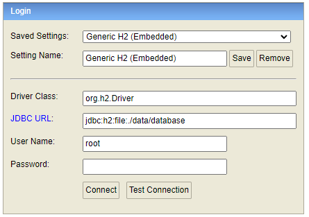
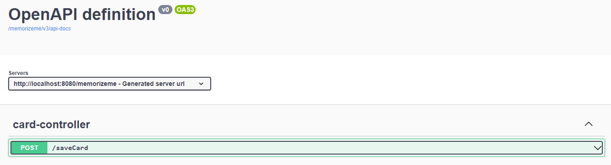

# MemorizeMe 

This is backend of Flashcard App. For academic study purposes

## Actuator
```
http://localhost:8080/memorizeme/actuator
```

## H2 Database with Persistence File
```
http://localhost:8080/memorizeme/h2-console

Filedata: ./data/database.mv.db
User and Pass in application.properties configuration
```



## API Endpoint
The REST API to the example app is described below.

## Swagger UI
```
http://localhost:8080/memorizeme/swagger-ui/index.html
```



## Author
- [@ctrlshiftcode](https://www.github.com/ctrlshiftcode) - Alberto Uehara
